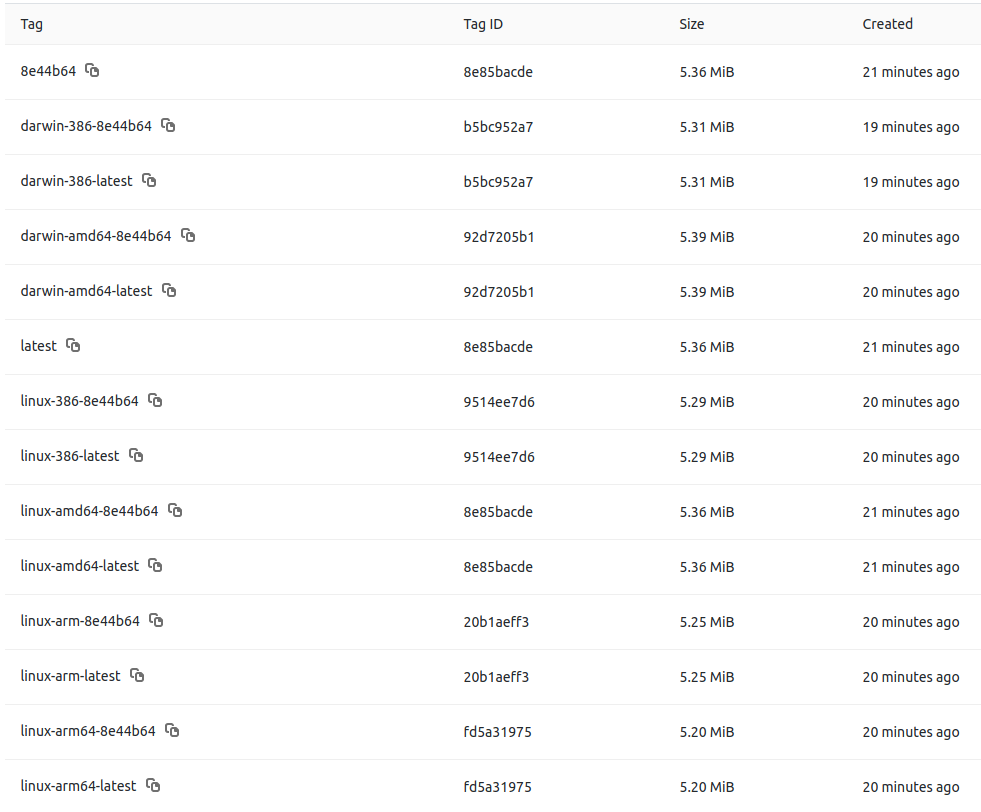

# go-proxy-multiarch

The main purpose of the repository is automated provisioning of Golang Docker containers for multiple CPU architectures. The included app is a stripped down version of our reverse proxy to a maintenance page hosted in AWS S3 bucket fronted by CloudFront CDN. By using a S3 bucket we maintain a centralized repository for our maintenance pages that is globally accessible and easy to maintain.

The container/app listens on TCP port `8989` by default but it can be overwritten during runtime via environment variable and/or command line flag. Same applies to the target URL which is by default set to `http://my-cdn.s3-website.my-region.amazonaws.com/maintenance/myapp/`. For example:

```bash
$ go run main.go
2019/07/22 11:12:21 forwarding to -> http://my-cdn.s3-website.my-region.amazonaws.com
2019/07/22 11:12:21 Starting the service listening on port :8989 ...

$ PORT=8084 go run main.go
2019/07/22 11:12:21 forwarding to -> http://my-cdn.s3-website.my-region.amazonaws.com
2019/07/22 11:12:21 Starting the service listening on port :8084 ...

$ go run main.go -port=8081 -proxy_target_url=http://google.com/
2019/07/22 10:55:38 forwarding to -> http://google.com
2019/07/22 10:55:38 Starting the service listening on port :8081 ...
```

If both set the command line flag will have priority:

```bash
$ PORT=8084 go run main.go -port=8090
2018/06/14 10:13:30 Starting the service listening on port :8090 ...
```

The container has liveness `/healthz` and readiness `/readyz` end points too for Kubernetes probes. It also simulates 1 second load time to make the readiness check more realistic as shown below.

```bash
$ go run main.go
2019/07/22 11:12:21 forwarding to -> http://my-cdn.s3-website.my-region.amazonaws.com
2019/07/22 11:12:21 Starting the service listening on port :8989 ...
2019/07/22 11:12:21 Ready NOK
2019/07/22 11:12:22 Ready OK
```

# Building Multi-arch Images

The motivation is to provide Docker images for use with the [AWS EC2 A1 Instances](https://aws.amazon.com/about-aws/whats-new/2018/11/introducing-amazon-ec2-a1-instances/) that deliver significant cost savings and are ideally suited for scale-out and Arm-based workloads that are supported by the extensive Arm ecosystem. A1 instances are the first EC2 instances powered by AWS Graviton Processors that feature 64-bit Arm Neoverse cores and custom silicon designed by AWS.

At the end of the GitLab pipeline we end up with multiple images as shown below:



We utilize the Makefile provided with the project. To build and push docker images for multiple architectures we simply run:

```bash
$ make docker
```

To run through the full stack of linting and testing the binary before we build the Docker images we run (needs Go properly installed and setup if executing this locally):

```bash
$ make all
```

By deafult images are built for the following architectures: linux/amd64, linux/386, linux/arm, linux/arm64, darwin/amd64 and darwin/386. This can be changed via the `PLATFORMS` variable in runtime, for example:

```bash
$ PLATFORMS="linux/amd64 linux/arm64"
```

Execute `make help` to find out the available `make` targets. The `DOCKER_REGISTRY` and `DOCKER_REPOSITORY` are some of the environment variables we can edit in runtime if necessary:

```bash
$ DOCKER_REGISTRY=<value> DOCKER_REPOSITORY=<value> make all 
```
Or strictly passing them as make variables which will also work:

```bash
$ make DOCKER_REGISTRY=<value> DOCKER_REPOSITORY=<value> all 
```

Check the `Makefile` for complete list of variables.

After running `make docker` or `make all` as mentioned above, we also get a [Docker Manifest](https://docs.docker.com/engine/reference/commandline/manifest/) created that holds a description of all the images 

```bash
$ docker manifest inspect $DOCKER_REGISTRY/projects/go-proxy-multiarch:f5b1c7f
{
   "schemaVersion": 2,
   "mediaType": "application/vnd.docker.distribution.manifest.list.v2+json",
   "manifests": [
      {
         "mediaType": "application/vnd.docker.distribution.manifest.v2+json",
         "size": 1157,
         "digest": "sha256:8b452e3a80d985693ca2419cae8bc3221434834206186ea690e5e3c7487e3e68",
         "platform": {
            "architecture": "386",
            "os": "darwin"
         }
      },
      {
         "mediaType": "application/vnd.docker.distribution.manifest.v2+json",
         "size": 1157,
         "digest": "sha256:700c7d1677947b3d1349f2679add456ffd0fbddeb35ad23714667cfdc4b59a9b",
         "platform": {
            "architecture": "amd64",
            "os": "darwin"
         }
      },
      {
         "mediaType": "application/vnd.docker.distribution.manifest.v2+json",
         "size": 1157,
         "digest": "sha256:e8a6051bc7457afbd76c128f49a4f662c66ca6156920bb276f0b05e0b2d57b27",
         "platform": {
            "architecture": "386",
            "os": "linux"
         }
      },
      {
         "mediaType": "application/vnd.docker.distribution.manifest.v2+json",
         "size": 1157,
         "digest": "sha256:7816c936340293153146ec860a1ce02ecbd744ea1dbf7978bb035961677304f3",
         "platform": {
            "architecture": "amd64",
            "os": "linux"
         }
      },
      {
         "mediaType": "application/vnd.docker.distribution.manifest.v2+json",
         "size": 1157,
         "digest": "sha256:5ca45598cd7bde4d72845f14acc2baa93dadb693e9dfa8b2c11835f37019e329",
         "platform": {
            "architecture": "arm",
            "os": "linux"
         }
      },
      {
         "mediaType": "application/vnd.docker.distribution.manifest.v2+json",
         "size": 1157,
         "digest": "sha256:6fb06edd39392a2fa11e60ff01319dedda79e7125b7cb0da34e5c3139235d767",
         "platform": {
            "architecture": "arm64",
            "os": "linux"
         }
      }
   ]
}

$ docker manifest push $DOCKER_REGISTRY/projects/go-proxy-multiarch:f5b1c7f
sha256:930ee604c2e3c38b33a89b9b3f4a1b9ecb90c74fa3512c3810a83990bea16524
```

It uses `docker manifest` command which is experimental and needs to be enabled by editing the `~/.docker/config.json` file and setting `experimental` to `enabled` for the user running the Docker client. The same parameter but with value `true` needs to be enabled for the Docker daemon too in the `/etc/docker/daemon.json` file.

By providing Docker Manifest to the registry we make it possible to always reference our image as `$DOCKER_REGISTRY/projects/go-proxy-multiarch:[f5b1c7f | latest]` no matter the architecture we are running on and the docker client will pull down the correct image for us.

This is an example of pulling the `go-proxy-multiarch:latest` on a linux amd64 machine:

```bash
$ docker pull $DOCKER_REGISTRY/projects/go-proxy-multiarch:latest
latest: Pulling from projects/go-proxy-multiarch
050382585609: Pull complete 
d4455207f581: Pull complete 
bf48981c7f63: Pull complete 
ab951a48b278: Pull complete 
Digest: sha256:7816c936340293153146ec860a1ce02ecbd744ea1dbf7978bb035961677304f3
Status: Downloaded newer image for $DOCKER_REGISTRY/projects/go-proxy-multiarch:latest

$ docker inspect $DOCKER_REGISTRY/projects/go-proxy-multiarch:latest
[
    {
        "Id": "sha256:97c4a2e60c7dfb0baa2340b11863ed11478d787c341525dcc756b7b9910951d4",
        "RepoTags": [
            "$DOCKER_REGISTRY/projects/go-proxy-multiarch:latest"
        ],
[...]
        "DockerVersion": "18.03.0-ce",
        "Author": "",
        "Config": {
[...]
        },
        "Architecture": "amd64",
        "Os": "linux",
        "Size": 13106648,
        "VirtualSize": 13106648,
        "GraphDriver": {
            "Data": null,
            "Name": "aufs"
        },

    }
]
``` 

where we can see Docker automatically choosing the right image version (notice the Digest hash for the image being same as in the Manifest above) that matches the local architecture thanks to the Docker Manifest. Lets give the image a test run:

```bash
$ docker run -dit --rm -p 8989:8989 --name go-proxy-multiarch $DOCKER_REGISTRY/projects/go-proxy-multiarch:latest
bb12d5acb6a740e738c6753a4eeb8ea6742c4756f98e373d82cad3f16639c262

$ curl -sSNIL http://127.0.0.1:8989/
HTTP/1.1 200 OK
Content-Length: 10656
Content-Type: text/html
Date: Tue, 23 Jul 2019 02:20:06 GMT
Etag: "09eebd280f81db787eb9d80e8842ed59"
Last-Modified: Thu, 27 Jun 2019 00:54:48 GMT
Server: AmazonS3
X-Amz-Id-2: 8gnTxlOqufGNUxhgSEI+zV6A3AxE97WXWcm/MVPuvw+TZg1TcHB4sLJ+p+qxsWsUvJuE7bapkCw=
X-Amz-Request-Id: 4A54B78DCABE92B6
X-Amz-Version-Id: EhIK9BL0OAAsInTq6I6GMRMvyvkB3BSf
X-Proxy: localhost

$
```

and all is working as expected.

# GitLab CI/CD Pipeline

The provided `.gitlab-cy.yml` is used in our GitLab CI/CD pipeline. It runs through `dep`, `test` and `build` stages. The `build` stage is pretty simple:

```
build:
  stage: build
  dependencies:
    - dep
  image: $DOCKER_IMAGE
  variables:
    #DOCKER_CLI_EXPERIMENTAL: "enabled" # not needed, enabled in the image
    #DOCKER_TAG: $CI_JOB_ID             # Optional: override the image tag in the Makefile (commit hash by default)
  services:
    - $DOCKER_DIND_IMAGE
  before_script:
    - apk --no-cache add --update build-base bash
    - docker version
    - docker login -u gitlab-ci-token -p $CI_JOB_TOKEN $CI_REGISTRY
  script:
    - make docker
```

It uses the builder `igoratencompass/docker-dind-make` and DinD `igoratencompass/docker-dind:18.09.7` Alpine based Docker images with `experimental` feature enabled for `docker manifest` command to work. The builder image has `bash` and `build-base` installed to make compiling possible.